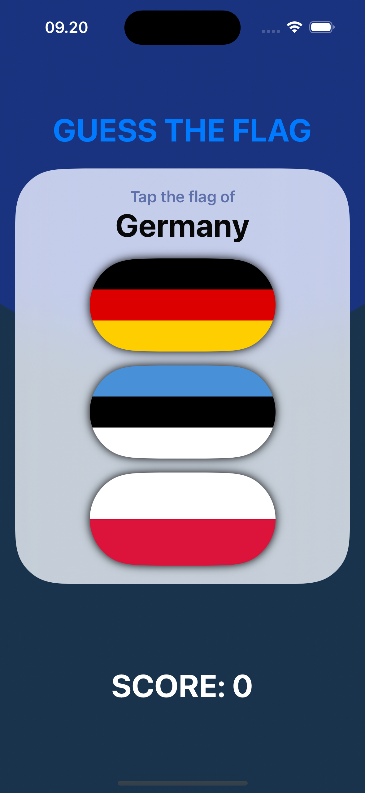
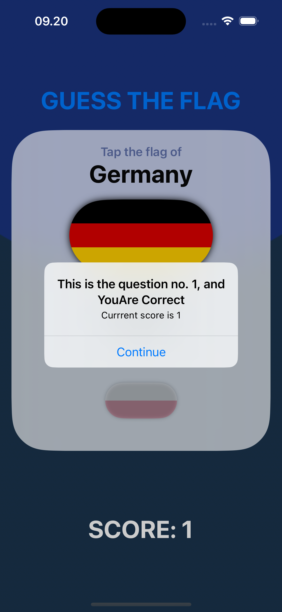

# GuessTheFlag
GuessTheFlag is a simple iOS game where users test their knowledge of world flags. The app displays a country name and three flag options, and the player must guess the correct flag. Each correct answer awards points, while incorrect guesses don't affect the score. A fun way to learn and challenge yourself on flags from around the world!
The source learning is from 2nd project of course "100 Days of SwiftUI" (https://www.hackingwithswift.com/100/swiftui)

# GuessTheFlag – Image Comments Feature

---

---

## Goals
1. Display a main view showing the country name, three flag options, and the current score.
2. When the correct flag is selected, the user gains a point, and an alert confirms the correct choice.
3. When an incorrect flag is selected, no points are awarded. An alert indicates the wrong selection and reveals the name of the chosen flag's country.
4. After the final question, the score is reset.

