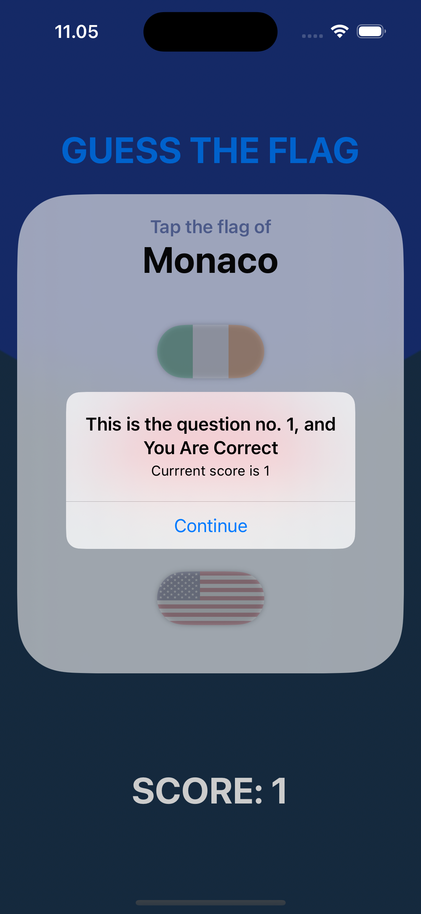

# GuessTheFlag
GuessTheFlag is a simple iOS game where users test their knowledge of world flags. The app displays a country name and three flag options, and the player must guess the correct flag. Each correct answer awards points, while incorrect guesses don't affect the score.

---
The source learning is from 2nd project of course "100 Days of SwiftUI" (https://www.hackingwithswift.com/100/swiftui)

---
## Game Features
1. **Main View Display**  
   - Shows the name of a country.
   - Provides three flag options for the user to select from.
   - Displays the current score.

2. **Correct Answer**  
   - When the correct flag is selected:
     - The user gains one point.
     - An alert confirms the correct choice.

3. **Incorrect Answer**  
   - When an incorrect flag is selected:
     - No points are awarded.
     - An alert notifies the user of the incorrect choice and displays the country name of the selected flag.

4. **End of Game**  
   - After the final question, the score is reset to zero.
# GuessTheFlag – Image Comments Feature

---

---

